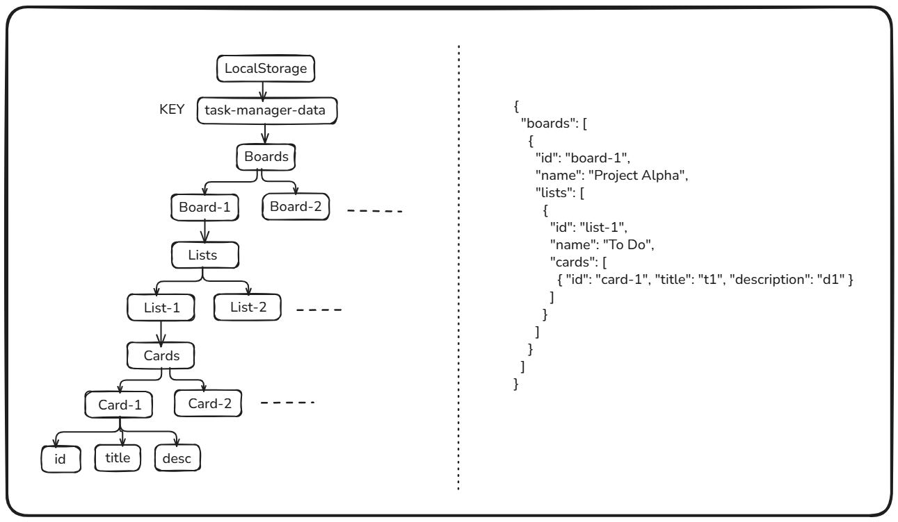

# [DEPLOYED LINK](task-manager-abhinavnaman.vercel.app) <- CLICK 
[https://task-manager-abhinavnaman.vercel.app/](https://task-manager-abhinavnaman.vercel.app/)

# Task Manager App (Trello-like Clone)
A lightweight, Trello-style task management app built with React, Vite, and TailwindCSS, featuring:
 - Multiple Boards
 - Lists and Cards
 - drag-and-drop between lists
 - Persistent state via localStorage
 - Task Search




## Getting Started
1. Clone the Repo
```
git clone https://github.com/your-username/task-manager-app.git
cd task-manager-app
```
2. Install Dependencies
```
npm install --legacy-peer-deps
```
⚠️ We use --legacy-peer-deps to allow react-beautiful-dnd to install alongside React 19.

3. Start Development Server
```
npm run dev
```
The app will be available at http://localhost:5173.


| Feature                     | Description                              |
| --------------------------- | ---------------------------------------- |
| 🗃️ Boards                  | Create/delete boards with multiple lists |
| 📋 Lists                    | Add/rename/delete lists inside boards    |
| 🧾 Cards                    | Add/edit/delete task cards               |
| 🔁 Drag & Drop              | Move cards between lists or reorder them |
| 🔍 Search                   | Search cards by title inside a board     |
| 💾 LocalStorage Persistence | All data is stored in the browser        |


## Tech Stack
- React (Functional Components + Hooks)
- Vite (for fast builds and dev environment)
- TailwindCSS (utility-first styling)
- react-beautiful-dnd (drag-and-drop)
- lucide-react (icons)
- localStorage (persistent offline data)

## Bonus Features (Optional):
- Drag-and-drop cards within a board.
- Search bar to filter tasks within a board.
- Dark mode toggle.
- Export/import entire state as JSON (to allow backup and restore).
